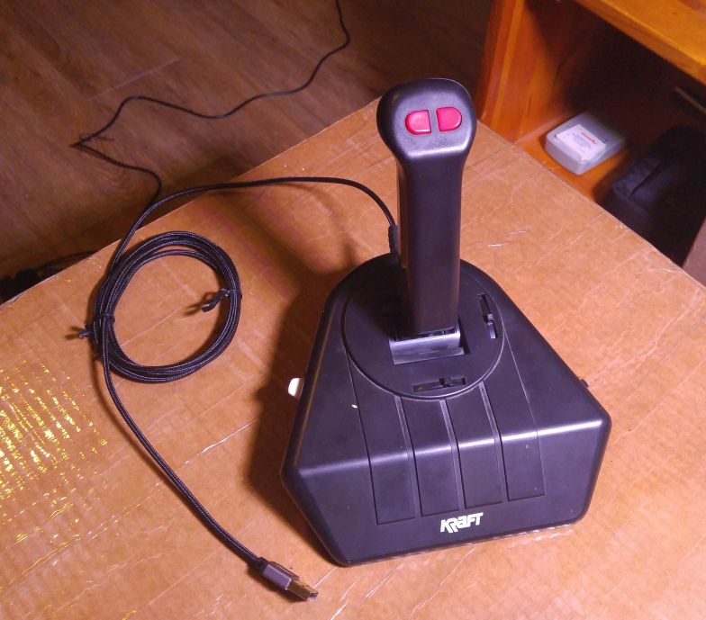
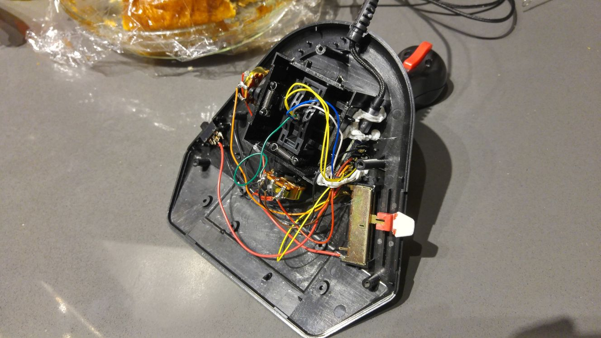

# Joystick Mouse  
  
I had a KRAFT THUNDERSTICK joystick, with a serial interface, sitting around collecting dust, so I decided to give it a whirl as a computer mouse. This code will let an Arduino read the buttons and potentiometers in the joystick and send HID inputs to an attached computer over USB. On one hand, this works! On the other, it turns out joysticks don't make good computer mice.  
  
    
    